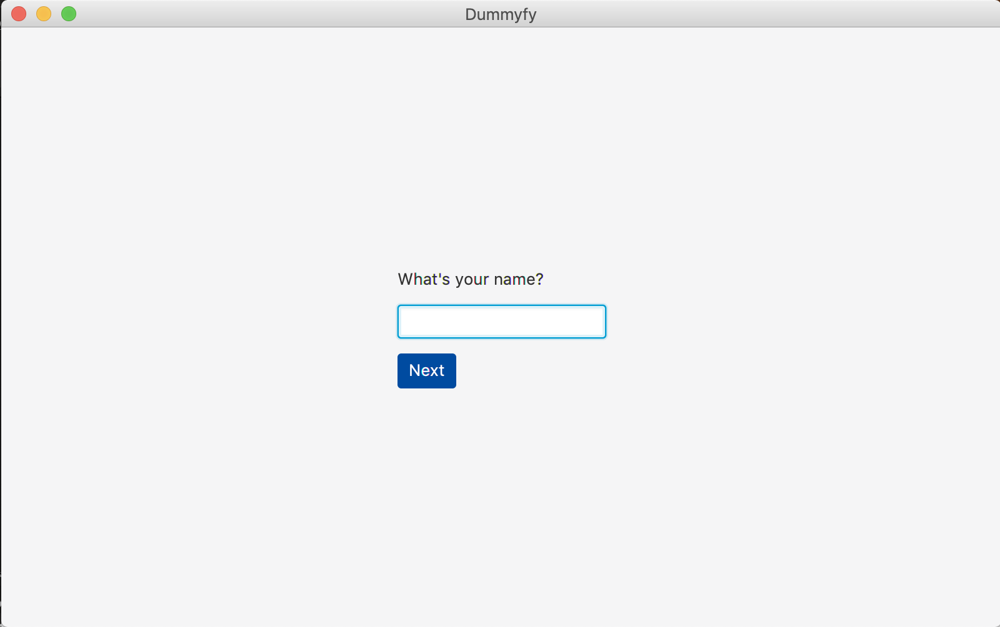
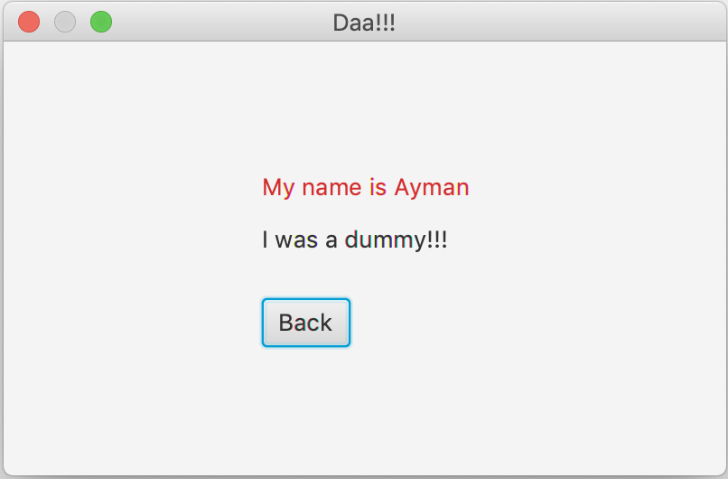

# Specification
### todo
- Ask For Name
- next reffering to the name say
  - My name is {name}. I was a dummy!!! 
- make JAR file of the code for ease of use
### restriction
- Not to use Swing and awt library

# Design

#### Window 1
Ask for Name with input field
have button to go to open popup

#### Window 2
Show msg with given name in colored
Have back button

# Implementation
- Used JavaFX Library for GUI
- used 2 differrnt window, one for geting data passing to the next window and 2nd for shoing the data

#### Window 1

#### Window 2
